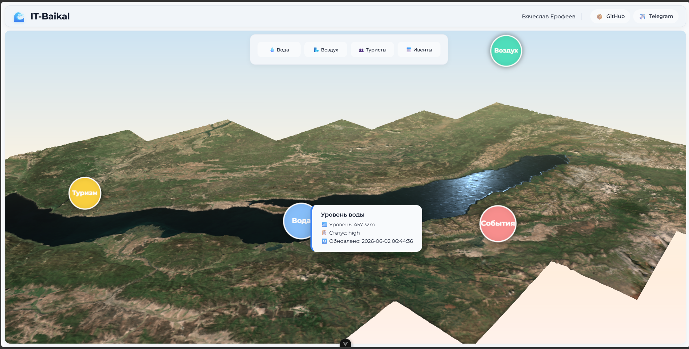

# 🌊 IT‑Baikal

**Интерактивная 3D‑платформа для экологического мониторинга озера Байкал**  

> 🧊 Не просто карта. Не просто дашборд.  
> **IT‑Baikal** — это погружение в экосистему самого глубокого озера планеты через веб‑технологии.



---

## 🎯 Зачем создан этот проект

Проект разработан в образовательных и конкурсных целях, но может быть развёрнут как **реальный инструмент мониторинга**:

- ✅ **Демонстрация возможностей веб‑разработки** (Vue 3 + Three.js)
- ✅ **Образовательный стенд** для колледжей и вузов 
- ✅ **Основа для хакатонов / конкурсов** (участники могут дорабатывать клиент или бэкенд)
- ✅ **Прототип туристического / экологического дашборда** для местных сообществ

Проект показывает, как **современный фронтенд + бэкенд с мок‑данными** могут визуализировать экологическую статистику в реальном времени.

---

## 🗺️ Что умеет IT‑Baikal

| Функция | Описание |
|---------|----------|
| 🌐 **3D‑сцена Байкала** | модель, загружаемая через Three.js + GLTF |
| 📍 **Интерактивные маркеры** | 4 ключевые точки: Вода, Воздух, Туризм, События |
| 🧠 **Raycaster‑наведение** | Ховер по маркерам → увеличение спрайта + тултип |
| 💾 **Актуальные данные** | Laravel API генерирует случайные, но правдоподобные показатели |
| 🌙 **День / ночь** | Плавное затемнение через CSS‑оверлей (без пересвета сцены) |
| 🔔 **Уведомления** | Pinia‑store + глобальный компонент (снизу справа) |
| 📱 **Адаптив** | Работает на десктопе, планшетах и узких экранах (360px) |
| 🧩 **Глобальное состояние** | Pinia (API‑store, нотификации) |

---

## 🧱 Стек технологий

### Frontend
- **Vue 3** (Composition API, `<script setup>`)
- **Vue Router**
- **Pinia** — управление состоянием (API, уведомления)
- **Three.js** — 3D, камера, спрайты, raycasting
- **GLTFLoader** — загрузка моделей
- **CSS3** — Flex, Grid, адаптив, анимации, blur‑эффекты

### Backend (демо / для конкурса)
- **Laravel** (REST API)
- Рандомные мок‑данные, приближённые к реальным
- Эндпоинт: `/api/dashboard`

### Инструменты
- **Vite** — сборка
- **ESLint / Prettier** — по желанию
- **Git + GitHub** — портфолио

---

## 🌍 Как проект помогает Бурятии и региону

Байкал — это не только природа, но и **туризм, экология, экономика региона**.  
IT‑Baikal может стать:

- Образовательным инструментом для **ВУЗов, техникумов**
- Основой для реального **экологического мониторинга** (замена мок‑данных на сенсоры)
- Промо‑сайтом для туристических кластеров (Байкальск, Ольхон, Иволгинский район)

Проект показывает молодым разработчикам Бурятии, что **3D и серьёзные веб‑приложения можно делать не выезжая из региона**.

---

## 🧪 Для конкурса / жюри / колледжа

- ✅ Работоспособность 100% (проверено в Chrome, Firefox)
- ✅ Чистая архитектура (composables, store, компоненты)
- ✅ Есть бэкенд, есть фронт, есть связь через API
- ✅ Адаптив и UX не страдают
- ✅ Код готов к публикации и доработке

---

## 🚀 Быстрый старт (для участников и проверяющих)

```bash
# Клонируем фронтенд
git clone https://github.com/BymBu/IT-baikal

фронтенд
cd frontend

# Устанавливаем зависимости
npm install

# Запускаем дев‑сервер
npm run dev

Бекенд
cd backend
php artisan serve 

# могут быть ошибки при запуске, к примеру отсутствуют расширения в php, следуйте инструкции в ошибках

```
---
> ⚠️ Backend-часть (Laravel) предоставляется отдельно для участников конкурса.
> Мок‑данные генерируются автоматически при каждом запросе к /api/dashboard.

---
**👤 Автор**
Ерофеев Вячеслав
Студент / fullstack веб‑разработчик

Telegram: @slepta

---
«Я сделал этот проект, чтобы показать:
3D, Vue, Laravel — это не страшно. Это интересно.
И Байкал заслуживает современного цифрового лица».

---
**📄 Лицензия**
MIT — свободно для обучения, конкурсов и портфолио.
При публикациях ссылка на автора приветствуется.
